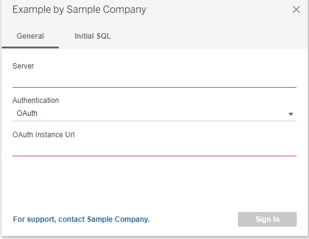
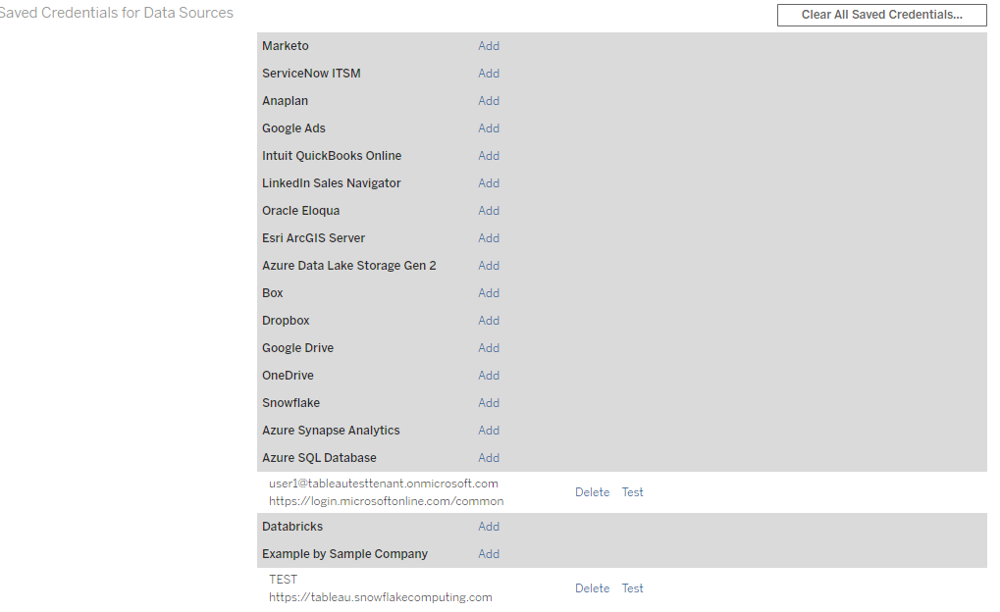

**IMPORTANT:** This feature is available only in Tableau 2021.1 or later. 

# How to enable OAuth for a plugin connector

First check your Database and Driver document to make sure if it supports OAuth.

To enable OAUth for your connector, in the manifest add another field `<oauth-config>` and link to a oauthConfig.xml you created, described below. 

```xml
  manifest.xml

  <?xml version='1.0' encoding='utf-8' ?>

  <connector-plugin class=...>
    ...
    <dialect file='dialect.tdd'/>
    <oauth-config file='oauthConfig.xml'/>    <!-- add this to to define your OAuth Configs -->
  </connector-plugin>
```

In your connectionFields.xml file make sure add an authentication with value equal to "oauth"

```xml
  connectionFields.xml Single Auth Type:

  <field name="authentication" label="Authentication" category="authentication" value-type="string" editable="false" default-value="oauth" />
```

```xml
  connectionFields.xml Multiple Auth Types:

  <field name="authentication" label="Authentication" category="authentication" value-type="selection" default-value="auth-user-pass" >
    <selection-group>
      <option value="auth-user-pass" label="Username and Password"/>
      <option value="oauth" label="OAuth"/>
    </selection-group>
  </field>
```

In your connectionBuilder.js file you need to use your DB sepcific logic to handle how to pass in OAuth attributes. E.g. for snowflake:

```js
  connectionBuilder.js
  if(authAttrValue == "oauth")
    {
        params["AUTHENTICATOR"] = "OAUTH";
        params["TOKEN"] = attr["ACCESSTOKEN"];
    }
```

# The OAuth Config File

The OAuth Config file defines your oauth connector configs and also provide the ability to customize how your oauth flow should work.

The OAuth Config file ([XSD](https://github.com/tableau/connector-plugin-sdk/blob/dev-2021.1/validation/oauth_config.xsd)) is indentified in the manifest using the `<oauth-config>` element. Here we discuss the structure of this file.

## XML Elements

### `<pluginOAuthConfig>`

This is the parent element for all fields.

### `Elements`

Each OAuth config attribute is represented by an element in the XML, the element name is the attribute name and the content is the attribute value.

| Name  | Type | Meaning | Optional? | Notes |
| ----  | ------- | --------- | ----------- | ----------- |
| dbclass | String | The dbclass for your oauthConfig | No | dbclass must be same with the `class` attribute in manifest.xml | 
| clientIdDesktop | String | Client ID you registered for Tableau Desktop | Yes | This is not considered as secrets and will be stored in plain text | 
| clienSecretDesktop | String | Client Secret you registered for Tableau Desktop | Yes | This is not considered as secrets and will be stored in plain text | 
| redirectUrisDesktop | String[] | Redirect Urls for Desktop | Yes	| The host for redirectUrisDesktop must be a valid loopback address| 
| authUri | String | Authorization endpoint URI | No | |
| tokenUri | String | Token endpoint URI | No | |
| userInfoUri | String | User Info UrI | Yes | |
| instanceUrlValidationRegex | String | Use to validate against your OAuth instance Url. | Yes | |
| scopes | String[] | scopes | No | |
| capabilities | Map<String, String> | This defines how oauth flow behaves differently according the caps you set. | Yes | |
| accessTokenResponseMaps | Map<String, String> | Key value pair that maps an initial token request response attribute <value> to Tableau recognized attribute <key> | No | |
| refreshTokenResponseMaps | Map<String, String> | Key value pair that maps an refresh token request response attribute <value> to Tableau recognized attribute <key> | Yes | if not defined will use accessTokenResponseMaps by default |

## Supported OAuth Capabilities

This set of OAuth Config capabilities are not shared with the regular connector capabilities.

| Capability Name  | Description | Default | Recommendation | 
| ----  | ------- | --------- | ----------- |
| CAP_SUPPORTS_CUSTOM_DOMAIN | Whether your OAuth provider supports custom domain. i.e. OAuth endpoint host is not fixed. | false | - |
| CAP_REQUIRE_PKCE | Whether your OAuth provider supports PKCE, more detials: https://oauth.net/2/pkce/ | false | true |
| CAP_PKCE_REQUIRES_CODE_CHALLENGE_METHOD | Whether your OAuth provider PKCE requires code_challenging_method passed in. If set to true, we are using S256 by default. | false | true |
| CAP_SUPPORTS_STATE | Used to protect against CSRF attacks, more details: https://auth0.com/docs/protocols/state-parameters | false | true |
| CAP_REQUIRES_VERIFY_STATE | Used together with CAP_SUPPORTS_STATE | false | true |
| CAP_GET_USERNAME_USES_POST_REQUEST | Only use if you define a USERINFO_URI in oauthConfig file to retrieve the userinfo in a separate request | false | - |
| CAP_CLIENT_SECRET_IN_URL_QUERY_PARAM | Use this if Client secrets are expected in the query parameter instead of the request header. | false | - |
| CAP_FIXED_PORT_IN_CALLBACK_URL | Use this when your OAuth provider native app(Tableau Desktop) OAuth clients only support fixed callback url | false | - |
| CAP_SUPPORTS_HTTP_SCHEME_LOOPBACK_REDIRECT_URLS | Use this when your OAuth provider native app(Tableau Desktop) OAuth clients support Loopback callback url. E.g. https://developers.google.com/identity/protocols/oauth2/native-app | false | - |
| CAP_REQUIRES_PROMPT_CONSENT | Add prompt=consent to the request. | false | - |
| CAP_REQUIRES_PROMPT_SELECT_ACCOUNT | Add propmt=select_account to the request. More details: https://docs.microsoft.com/en-us/azure/active-directory/develop/v2-oauth2-auth-code-flow | false | - |
| CAP_SUPPORTS_GET_USERINFO_FROM_ID_TOKEN | Used when your OAuth response contains a JWT style ID_TOKEN that can be parsed out to get actual username. e.g. https://docs.microsoft.com/en-us/azure/active-directory/develop/id-tokens | false | - |

## Example OAuthConfig file:
**oauthConfig.xml**

```xml
<?xml version="1.0" encoding="utf-8"?>
<pluginOAuthConfig>
    <!-- dbclass must correspond to the class registered in manifest.xml --> 
    <dbclass>snowflake_oauth</dbclass>
    <!-- Subsitute these with your OAuth Client Id and Client Secret -->
    <clientIdDesktop>[your_client_id]</clientIdDesktop>
    <clientSecretDesktop>[your_client_secret]</clientSecretDesktop>
    <-- Desktop redirectUri, subsitute for your own registered desktop redirectUri --> 
    <redirectUrisDesktop>http://localhost:55555/Callback</redirectUrisDesktop>
    <!-- authUri and tokenUri only contains the path since it has CAP_SUPPORTS_CUSTOM_DOMAIN on, so the final oauth endpoint will be 
    your input instanceUrl + authUri/tokenUri -->
    <authUri>/oauth/authorize</authUri>
    <tokenUri>/oauth/token-request</tokenUri>
    <!-- Used to prevent malicious instanceUrl, your instanceUrl must match this regular expression or OAuth flow will abort -->
    <instanceUrlValidationRegex>^https:\/\/(.+\.)?(snowflakecomputing\.(com|us|cn|de))(.*)</instanceUrlValidationRegex>
    <!-- Snowflake need refresh_token scope to issue refresh tokens -->
    <scopes>refresh_token</scopes>
    <!-- Snowflake supports PKCE, Cutom domain, fixed callback url -->
    <capabilities>
        <entry>
            <key>CAP_PKCE_REQUIRES_CODE_CHALLENGE_METHOD</key>
            <value>true</value>
        </entry>
        <entry>
            <key>CAP_SUPPORTS_CUSTOM_DOMAIN</key>
            <value>true</value>
        </entry>
        <entry>
            <key>CAP_REQUIRE_PKCE</key>
            <value>true</value>
        </entry>
        <entry>
            <key>CAP_FIXED_PORT_IN_CALLBACK_URL</key>
            <value>true</value>
        </entry>
        <entry>
            <key>CAP_PKCE_REQUIRES_CODE_CHALLENGE_METHOD</key>
            <value>true</value>
        </entry>
    </capabilities>
    <!-- Map Tableau recognized attr <key> to Snowflake OAuth response attr <value> -->
    <accessTokenResponseMaps>
        <entry>
            <key>ACCESSTOKEN</key>
            <value>access_token</value>
        </entry>
        <entry>
            <key>REFRESHTOKEN</key>
            <value>refresh_token</value>
        </entry>
        <entry>
            <key>access-token-issue-time</key>
            <value>issued_at</value>
        </entry>
        <entry>
            <key>access-token-expires-in</key>
            <value>expires_in</value>
        </entry>
        <entry>
            <key>username</key>
            <value>username</value>
        </entry>
    </accessTokenResponseMaps>
    <!-- No refreshTokenResponseMaps needed since that's same with the accessTokenResponseMaps -->
 </pluginOAuthConfig>

```
# OAuth on Tableau Desktop

Your Desktop sign in Dialog will look like this, you can choose different auth mode and notice different required fields appear. This example has multiple auth type supported and one of them is oauth. 



By clicking the sign in button, you will be directed to your OAuth Provider's sign in Url in a default browser on your machine where you can input your credentials, Tableau will get the required attrs back and upon complete you will see this screen:


# OAuth on Tableau Server

## Configure OAuth Clients on Server

Config your OAuth client on your server: This would be the first step you need to perform for enabling OAuth on Tableau Server, this will setup OAuth Client information to be used on Tableau Server, e.g.:
```
tsm configuration set -k oauth.config.clients -v "[{\"oauth.config.id\":\"snowflake_oauth\", \"oauth.config.client_id\":\"[your_client_id]\", \"oauth.config.client_secret\":\"[your_client_secret]\", \"oauth.config.redirect_uri\":\"[your_redirect_url]\"}]" --force-keys
```
You need to subsitute [your_client_id], [your_client_secret], [your_redirect_url] with the ones you registered in your provider's OAuth registration page.
[your_redirect_url] needs to follow certain format, if your server address is https://Myserver/ then [your_reirect_uri] needs to be https://Myserver/auth/add_oauth_token.

## Server Add OAuth token flow

To add an OAuth credential on Tableau Server, you will go to **My Account Settings** page, look for your class in the **Saved Credentals For DataSources** Section.
After successfully added your credential you will notice an entry appear under your class.



## Desktop Publish flow

hen publishing a pluggable OAuth Workbook/DataSource to Tableau Server, you wil see multiple auth options:
**Prompt** means this resource will published without embedding credential, viewers would need to provide credential to access the resource.
**Embedding [your_username]** means you will embed the credential with username **[your_username]** to this resource, so all the viewer can use the same credential **[ABC]** to access the resource. Note in order for this to show up, you must already have added a saved OAuth credential according to previous section. You would see multiple entries if you have multiple records of saved credentials and you can pick which one you wanna use for embedding. 
**Embed Password** is no longer a supported auth mechanism for Pluggable OAuth connectors and an error will show up if you choose that option.


## Web Create flow

For Web Create, the UI dialog would be same with Tableau Desktop with the difference that we are using the server OAuth Client configs.
